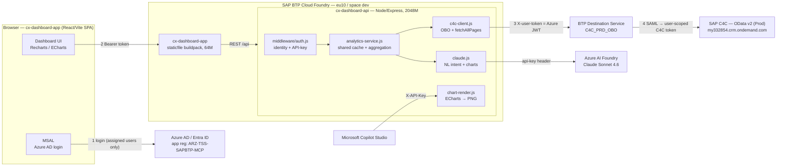
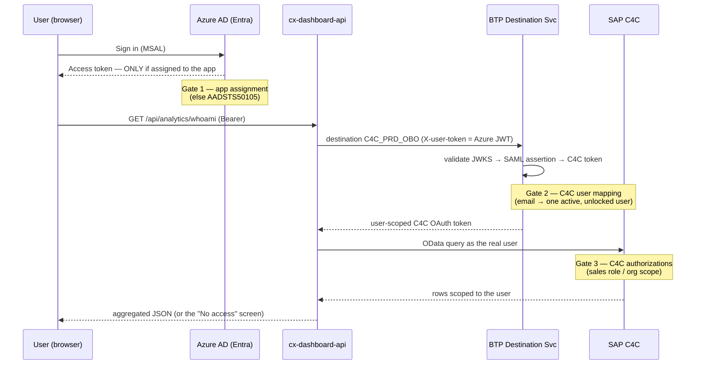
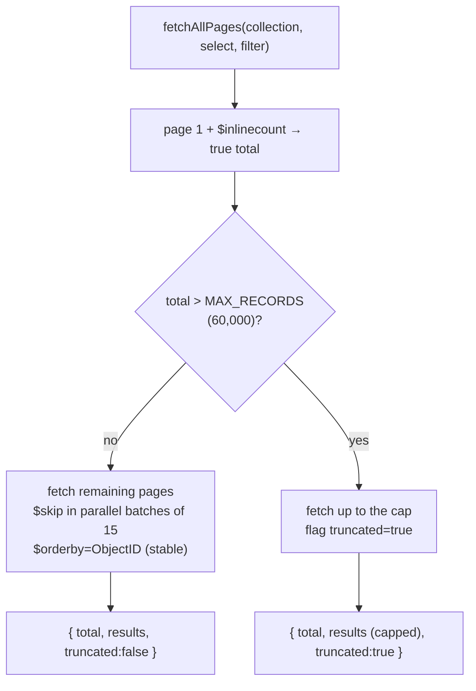
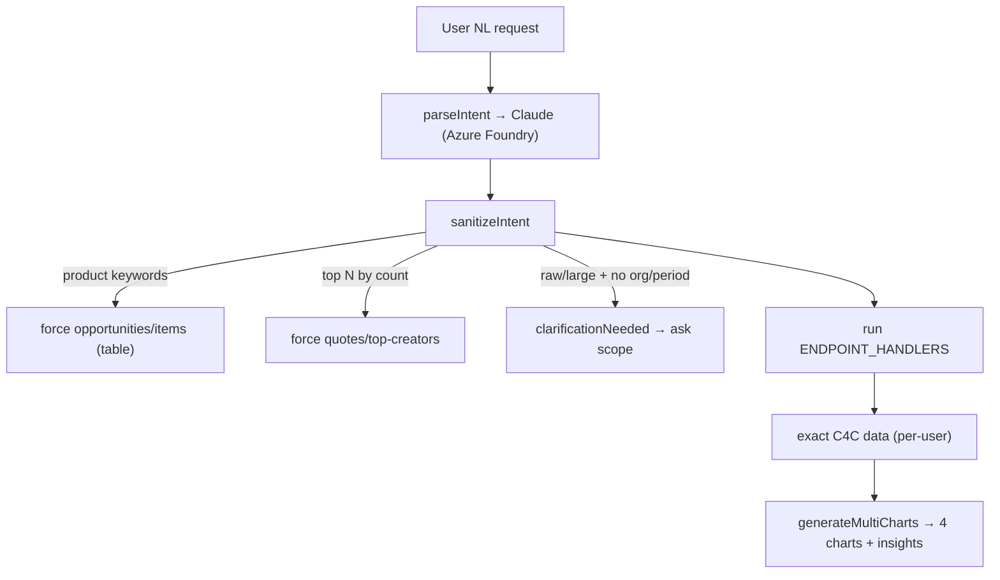

# TSS C4C Dashboard — Architecture

> Living architecture reference for the **CX AI Intelligence** dashboard (a.k.a. TSS C4C Dashboard). Companion to `PROJECT_HANDOFF.md` (which holds the deeper "why", field mappings, and operational runbook). Diagrams below are Mermaid and render natively on GitHub.

Monorepo `dhruvinmehta27/CX_MCP_DATA`:
- **`cx-dashboard-api/`** — Node/Express backend (C4C analytics + Claude AI), on SAP BTP Cloud Foundry
- **`cx-dashboard-app/`** — React/Vite SPA frontend, served statically on Cloud Foundry

---

## 1. System architecture



**Platform:** SAP BTP Cloud Foundry, region **eu10**, space `dev`. Two apps deployed independently (`cf push` per app dir). Bound services on the API: `cx-destination` (Destination Service), `cx-xsuaa-mcp` (XSUAA).

---

## 2. Authentication & the three access layers

Login is **Azure AD**, then data is fetched **as the real user** via **On-Behalf-Of (OBO)** through the BTP Destination Service — **no XSUAA token exchange**. A user must pass **three independent gates**; each fails differently and is owned by a different admin.



| Gate | Failure symptom | Fix owner |
|---|---|---|
| **1. Azure app assignment** | `AADSTS50105` — blocked at Microsoft sign-in | **Entra admin** — assign user/group to `ARZ-TSS-SAPBTP-MCP` |
| **2. C4C user mapping** | "could not be mapped to user" → "No access" screen | **C4C admin** — one active, unlocked business user, unique email, sales role |
| **3. C4C authorizations** | `HTTP 403` on OData → "No access" screen | **C4C admin** — grant sales business role / org scope |
| *(reachability)* | "Can't reach the dashboard" (network) | User's IT / network |

**Tracing:** `GET /api/analytics/whoami` probes `OpportunityCollection?$top=1` as the user. On failure the API returns `{ ok:false, message }` and logs `[whoami] no C4C access for <email>: <reason>`. The `AccessGate` screen surfaces the reason and distinguishes **network** vs **C4C-denied**.

Key files: `c4c-client.js` (`getDestination`, `probeC4CAccess`), `middleware/auth.js`, `auth/AccessGate.jsx`. Azure runtime config: `cx-dashboard-app/public/config.js`.

---

## 3. The data-loading engine (`fetchAllPages`)

Because queries run as the signed-in user, a broad-access account over a wide range can mean **hundreds of thousands of records**. The engine keeps that fast, correct, and crash-proof.



- **60k record cap** (`C4C_MAX_RECORDS`) → a wide range can't OOM the 2 GB instance.
- **Parallel batches of 15** pages (1000 rows each) → fast without exhausting sockets.
- **`$orderby=ObjectID`** → stable pagination (no duplicate/skipped rows).
- **Exact counts via `$inlinecount`** (separate cheap query) → headline counts are exact even when the record fetch is capped.
- **Fail-closed**: when `truncated`, the UI shows **"—" / "narrow the range"** instead of a wrong partial number.
- **Shared raw-fetch cache** (`analytics-service.js` `rawQuotes/rawOpportunities/rawRFQs` via `getOrSet`) → the many quote endpoints share **one** paginated fetch per entity, with in-flight coalescing (no fetch stampede). ~15-min TTL, keyed per user.

> **Owner-protected core** (the "heart"): `c4c-client.js`, `aggregations.js`, `cache.js`, `middleware/auth.js`. See §7.

---

## 4. Backend module map (`cx-dashboard-api/src/`)

| Module | Role |
|---|---|
| `server.js` | Express app + error handler |
| `middleware/auth.js` | Bearer identity (per-user key) + `X-API-Key` for Copilot endpoints |
| `c4c-client.js` | **OBO auth chain**, `fetchAllPages`, inline counts, per-entity fetchers, `probeC4CAccess` |
| `analytics-service.js` | Shared raw-fetch cache + one aggregation function per endpoint + `ENDPOINT_HANDLERS` dispatch |
| `aggregations.js` | Pure functions: status classifiers (`isOpenStatus`, `isRfqOpen`), `oppValue`, sums/trends, pipeline overview |
| `account-cache.js` | Account → country map; enriches quotes with `BuyerCountry` / `ShipToCountry` |
| `cache.js` | `getOrSet` in-memory cache with in-flight coalescing |
| `claude.js` | NL → intent (`parseIntent`), scope clarification (`sanitizeIntent`), chart config, Sales Brief. Routes to **Azure AI Foundry** when `ANTHROPIC_BASE_URL` set |
| `chart-render.js` | Server-side ECharts → PNG (for Copilot inline images) |
| `routes/` | `analytics.js`, `dashboard.js`, `cache.js` |

---

## 5. Frontend pages (`cx-dashboard-app/src/`)

| Route | Page | Notes |
|---|---|---|
| `/` | Welcome / launchpad (Home) | Feature cards + data-object overview; no filter bar |
| `/briefing` | Daily Briefing | KPI tiles, activities (tasks/visits/meetings), pipeline by stage |
| `/quotes` | Quote Analytics | By status/org/type, trend, top customers, list |
| `/board` | Pipeline Command Center | 5 views: **Kanban · Funnel · Forecast · Flow (Sankey) · Bubble Matrix** |
| `/pipeline` | Pipeline Health | Funnel, by-owner, close trend, opps list |
| `/rfqs` | RFQ Tracker | Open/Closed/All + search |
| `/builder` | AI Report Builder | NL → 4-chart report (Claude) |
| `/brief` | Sales Brief | Audience-tailored, print-ready brief (Claude) |

Cross-cutting: `AccessGate` (no-C4C-access / network screen), shared **FilterBar** (dual-handle date slider, Sales Org dropdown, owner), `useFilters` (global applied filters), `useAnalytics` (fetch hook). Sidebar nav visibility is curated toward the AI tools + Home.

---

## 6. API endpoints

**Analytics** (`/api/analytics/…`, Bearer, per-user OBO):
`quotes/by-status`, `quotes/by-sales-org`, `quotes/trend`, `quotes/by-biz-type`, `quotes/top-customers`, `quotes/list`, `opportunities/pipeline`, `opportunities/pipeline-overview`, `opportunities/by-owner`, `opportunities/close-trend`, `opportunities/list`, `rfqs/by-status`, `rfqs/trend`, `rfqs/list`, `daily-summary`, `whoami`, `sales-orgs`.

**Dashboard / AI** (`/api/dashboard/…`):
`GET brief-stats`, `POST brief-plan`, `POST brief`, `POST plan`, `POST generate` (NL → 4 charts), `POST inline` (→ ECharts HTML, Copilot), `POST inline-image` (→ PNG, Copilot).

**AI-routable endpoints (16)** — `claude.js` `VALID_ENDPOINTS` ↔ `analytics-service.js` `ENDPOINT_HANDLERS` (kept in sync):

| Entity | Endpoints |
|---|---|
| Quotes (7) | `raw`, `by-status`, `by-sales-org`, `trend`, `by-biz-type`, `top-customers`, `top-creators` |
| Opportunities (4) | `items`, `pipeline`, `created-trend`, `by-sales-org` |
| RFQs (4) | `by-status`, `by-supplier`, `trend`, `list` |
| Summary (1) | `daily-summary` |

**AI Report Builder flow:**



---

## 7. Core data rules (non-negotiable)

- **Value = base currency** `ZBaseCurrency_KUTContent_KUT` (EUR), via `oppValue()` — never mix transaction currencies.
- **"Pipeline" = OPEN only** everywhere; Won/Lost/**Stopped** are closed. Server `isOpenStatus` ↔ client `statusBucket` must stay in sync.
- **Exact counts via `$inlinecount`**; **fail-closed** — show "—" if not provably exact.
- **RFQ closed = Confirmed / Rejected**.
- Invariant tests: `npm run test:aggregations`.

---

## 8. Deployment (runbook summary)

```bash
# API
cd cx-dashboard-api && git pull origin main && cf push
# Frontend (build first — dist/ is what ships)
cd cx-dashboard-app && git pull origin main && npm install && npm run build && cf push
```
- Secrets via `cf set-env` (never committed): `ANTHROPIC_API_KEY`, `INLINE_API_KEY`, and the Azure-Foundry routing vars `ANTHROPIC_BASE_URL`, `ANTHROPIC_AUTH_HEADER=api-key`, `ANTHROPIC_MODEL` (= the Foundry deployment name, e.g. `claude-sonnet-4-6`).
- `cf push` drops `INLINE_API_KEY` (not in manifest) — re-set after each API push if Copilot is used.
- **CF session expires** → `cf login -a https://api.cf.eu10.hana.ondemand.com --sso`.
- Hard-refresh after frontend deploy (staticfile + browser cache the old bundle).

See `PROJECT_HANDOFF.md` §9 for the full operational gotchas.

---

## 9. What has been built (change history)

**Original platform** — C4C analytics over per-user OBO: Daily Briefing, Quote Analytics, Pipeline Command Center (5 views), Pipeline Health, RFQ Tracker, AI Report Builder, Sales Brief; base-currency valuation, OPEN-only pipeline, exact inline counts + fail-closed guardrails, the paginated 60k-capped fetch engine, shared raw-fetch cache, Copilot inline chart endpoints.

**AI model routing** — Claude calls now route through **Azure AI Foundry** (`ANTHROPIC_BASE_URL` + `api-key` header), model `claude-sonnet-4-6`. First-party Anthropic still works when the vars are unset.

**Filter bar redesign** — date range → **dual-handle year-ticked slider** (keyboard-operable, fail-safe UTC math); Sales Org **search box → dropdown** sourced from `OrganisationalUnitFunctionsCollection` (CompanyIndicator) + `OrganisationalUnitNameAndAddressCollection`, joined on `OrganisationalUnitID`; sales-org scoping applied **in-process** (C4C can't filter `SalesOrganisationID`).

**Access / diagnostics** — `AccessGate` distinguishes **network** ("Can't reach the dashboard") vs **C4C denial**, shows a "Technical details" reason; backend logs `[whoami] no C4C access …`. (Used to trace real Azure-assignment and C4C-user issues for onboarding.)

**AI Report Builder (Abdul)** — 4-chart grid + plan explanation; **scope-clarification flow** (asks org/period for raw/large queries; inline text answers; "all orgs" shortcut); deterministic routing overrides (product detail → `opportunities/items`; "top N by count" → `quotes/top-creators`); new endpoints: **`quotes/top-creators`**, **`opportunities/items`** (line-item / product search with plural-tolerant, multi-keyword matching + "Did you mean?"), **`rfqs/by-supplier` / `rfqs/trend` / `rfqs/list`**.

**Sales Brief (Abdul)** — date-range selector, "AI understanding" step with scope warnings, org picker.

**Data enrichment (Abdul)** — account → country cache; quotes enriched with `BuyerCountry` / `ShipToCountry`.

**UX / branding (Abdul)** — Trelleborg logo + favicon throughout; redesigned Home page with feature cards + data-object overview; sidebar Home link; activities grouping on the home page; **PROD/QUA** system badge from a new `/api/info` endpoint.

> For the commit-level history, see `git log`. Known follow-ups: apply the fail-closed `truncated` signal to the newer `opportunities/items` / `rfqs/*` / `top-creators` endpoints; bound the parallel fan-out in `fetchOpportunityItemsByParents`.
